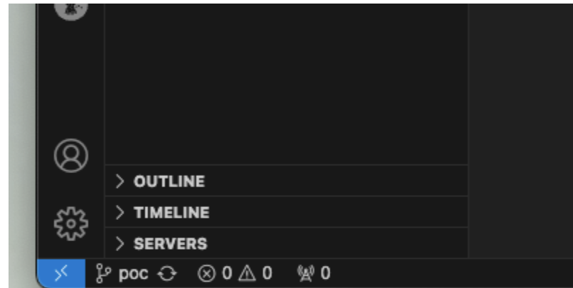

# Notes for running this POC

- be sure to fork repo first

  - from:  
`https://github.com/redhat-na-ssa/iha-poc.git`  
  - to:  
`https://github.com/<your org>/iha-poc.git`

- work off of branch `poc`  

```bash
git checkout branch poc
```

- Make sure you are on the correct branch from within your IDE



- Update three manifests with updated github URL:
  - `k8/app/eventlistener.yaml`
    - Line 34

```yaml
value: https://github.com/[CHANGE ME]/iha-poc.git
```
- `k8/app/pipeline.yaml`
    - Line 17
```yaml
value: https://github.com/[CHANGE ME]/iha-poc.git
```

- Once you have made the changes, commit and push the changes to the `poc` branch