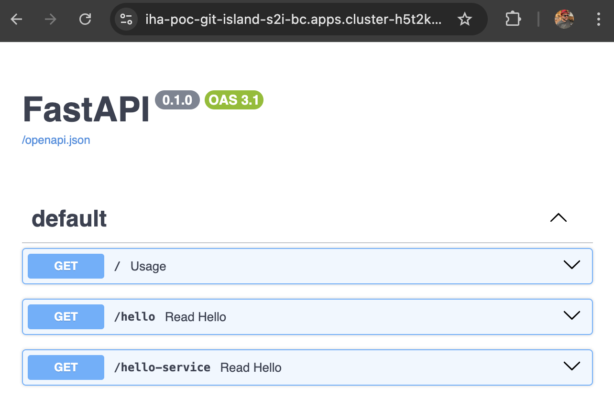
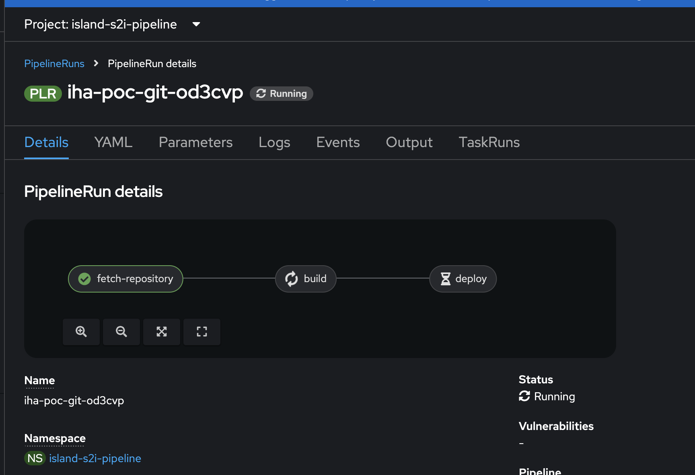

# Proof of Concept (PoC) Guide

## Overview 

This guide walks you through setting up and running a Proof of Concept (PoC) for deploying an application using OpenShift, Tekton Pipelines, and GitOps. It includes multiple deployment methods and automation techniques.

## Initial Setup

1. Fork the Repository

Create a fork from the `redhat-na-ssa` GitHub repo:

  - Source Repo:  
`https://github.com/redhat-na-ssa/iha-poc.git`  
  - Your Forked Repo:
`https://github.com/<your org>/iha-poc.git`

2. Create and check out the `poc` branch 

```bash
git checkout poc
```

Ensure you are on the correct branch in your IDE.


3.  Update GitHub URLs in Manifests

Modify the following YAML files to reflect your GitHub repository:

  - `k8/app/eventlistener.yaml` (Line 34)

```yaml
value: https://github.com/[CHANGE ME]/iha-poc.git
```

- `k8/app/pipeline.yaml` (Line 17)
 
```yaml
value: https://github.com/[CHANGE ME]/iha-poc.git
```

Commit and push these changes to the `poc` branch.

4. Login to OpenShift

Log into both the OpenShift Web Consol and CLI
  - Once you log into OpenShift Web Console, you should be able to obtain the login credentials from the UI

  

```bash
oc login --token=sha256~<your-token>
```

5. Install Required Operators

From OperatorHub, install:

  1. Red Hat OpenShift Pipelines
  2. Red Hat OpenShift GitOps

## Exploring Deployment Methods

This PoC covers four deployment methods:

1. Manual s2i (BuildConfig) via the web console
2. Manual s2i (Pipeline) process via web console
3. Deploying a Pre-built Container Image (From method 2)
4. Fully automated CI/CD deployment with Pipelines and GitOps 


### Manual s2i (BuildConfig) via the web console

- Create a project `island-s2i-bc`
  - via web console or
  
```bash
oc new-project island-s2i-bc
```

- Switch to the `Developer View`
- Ensure you are in the correct project
- Add a git-based app
  - +Add -> Import from Git
- Use build configuration to create from `poc` branch on repo


- Once deployed, you can follow the deployment logs 
- When deployment completes you can obtain the route from the web console or CLI

```bash
oc get route -n island-s2i-bc
NAME          HOST/PORT                                      PATH   SERVICES      PORT       TERMINATION     WILDCARD
iha-poc-git   iha-poc-git-island-s2i-bc.apps.<domain>.com          iha-poc-git   8080-tcp    edge/Redirect   None
```

- The Route URL will take you to a page that says:

```json
{
  "message": "See /docs for API usage"
}
```

- Append `/docs` to the end of the route to test the API with swagger


(*Note*: `/hello-service` does not currently work)

- You can test it via the command line as well via curl

```bash
 curl -X 'GET' \
  'https://iha-poc-git-island-s2i-bc.<DOMAIN>.com/hello' \
  -H 'accept: application/json'
{"message":"Hello World from python-rest-api-a"}
```

- Explore the generated manifests, such as
  - BuildConfig
  - Deployment
  - Service
  - Route

- Examples (CLI):

```bash
oc describe -n island-s2i-bc bc iha-poc-git
oc describe -n island-s2i-bc deployment iha-poc-git
oc describe -n island-s2i-bc service iha-poc-git
oc describe -n island-s2i-bc route iha-poc-git
```
- Scaling pods

Example of scaling to 4 replicas via the CLI

```bash
oc scale deploy/iha-poc-git --replicas=4 
```

- If you want to delete this project and start over again you can run
```bash
oc delete project island-s2i-bc
```
   - This will delete the namespace and all resources contained within it (`bc`, `deployment`, etc), and you can run the above steps again.

- To keep the project, and delete all the contained resources, use lables

```bash
 oc delete all -l app=iha-poc  
 ```
   - This will keep the namespace and delete all resources contained within it (`bc`, `deployment`, etc), and you can run the above steps again.

 
### Manual s2i (Pipeline) process via web console


- Create a project `island-s2i-pipeline`
  - via web console or
  
```bash
oc new-project island-s2i-pipeline
```

- Switch to the `Developer View`
- Ensure you are in the correct project
- Add a git-based app
  - +Add -> Import from Git
- Use `Build using pipelines` as the Build Option and create from `poc` branch on repo

- Once created, we can monitor the build via the `PipelineRun`


- From the `Topology` view, note the deployment that begins with the `el-event-listener-...`
  - This is the event listener, containing the webhook for automated builds with git-push events.
  - The webhook is the `route` associated with this deployment.
  - Copy the route via the web console or CLI

  ```bash
  oc get route -l app.kubernetes.io/managed-by=EventListener
  ```
  - In your GitHub repo Settings -> Webhooks->Add webhook to add this as the `Payload URL`
  - `Content type`: `application\json`

- Open the code in your IDE and make/commit/push some code changes (could be as simple as updating a README file if you like, or something simple in the python code found in `main.py`

Example:
```python
@app.get("/hello-island")
async def read_hello():
    # Return a JSON object with the key "message" and value "Hello World"
    return {"message": "Hello Island from " + service_local}
```

- Once you push the code, a new `PipelineRun` will start
- Check the new code to ensure your new app is deployed.
  - (Note: you may have to delete the pod to force a new image deployment)
  - Or update the `deplpoy` task:

 ```yaml
- name: deploy 
  params: 
    - name: SCRIPT 
      value: | 
        oc set image deploy/$(params.APP_NAME) $(params.APP_NAME)=$(params.IMAGE_NAME)@$(tasks.build.results.IMAGE_DIGEST) 
        oc rollout status deploy/$(params.APP_NAME)
```


### Use the previously built container image from method 2 to manually deploy to same or different Project/namespace

- Create a new Project/namspace `island-container-deploy`

```bash
oc new-project island-container-deploy   
```

- This time, we are going to deploy one of the existing images we built in the previous project `island-s2i-pipeline`
- Note you need to create the service account, to grant access to this image stream located in the other Project.
  - Copy and past it on the CLI provided in the web console.

```bash 
oc policy add-role-to-user system:image-puller system:serviceaccount:island-container-deploy:default --namespace=island-s2i-pipeline
```
### Fully automated CI/CD deplyment with Pipelines and GitOps

This is where it is really important that you are working off of the `poc` branch and have updated the `yaml` files mentioned earlier

- Log into gitops. Either with OpenShift credentials or default admin password

- To get to gitops page, click on the grid above

  - To get default admin password:

```bash
oc get secret/openshift-gitops-cluster -n openshift-gitops -o jsonpath='{.data.admin\.password}' | base64 -d 
```

- Deploy GitOps application

```bash
oc apply -f k8/gitops
```

- We need to run the pipeline in order to build our application
  - Go to the Project `island-ci-cd-poc` (GitOps created it for us)

- If pipeline fails, delete the container image (Should be in `imagePullBackoff`)
    - Subsequent pipeline runs should succeed

- Reset Event Listener Webhook settings for GitHub
  - URL is from EL route 

- Make some code changes, commit and push to trigger pipeline

Example

```python
@app.get("/hello-gitops")
async def read_hello():
    # Return a JSON object with the key "message" and value "Hello World"
    return {"message": "Hello gitops from " + service_local}
```

- This should trigger a new PipelinRun

## Autoscaling

For this deployment, there is a `HorizontalAutoscaler` configured with it

Horizontal Autoscaller
- Min 1
- Max 5
- CPU threshold 25%

Run Script to stress test autoscaler

```bash
sh scripts/stress-test.sh 
```

Currently scales to 5 in less than a minute.
Default takes 5 minutes to cool down to 1 (sometimes longer)

## Additional tasks for this project
- GitOps manual sync
- GitOps self-heal
- GitOps resource management
    - Note: default polling is 3 minutes
