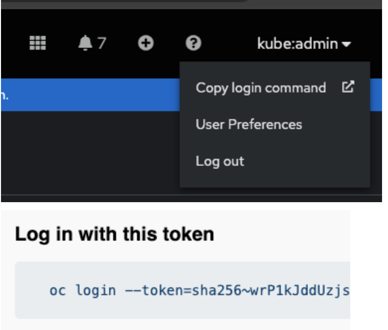
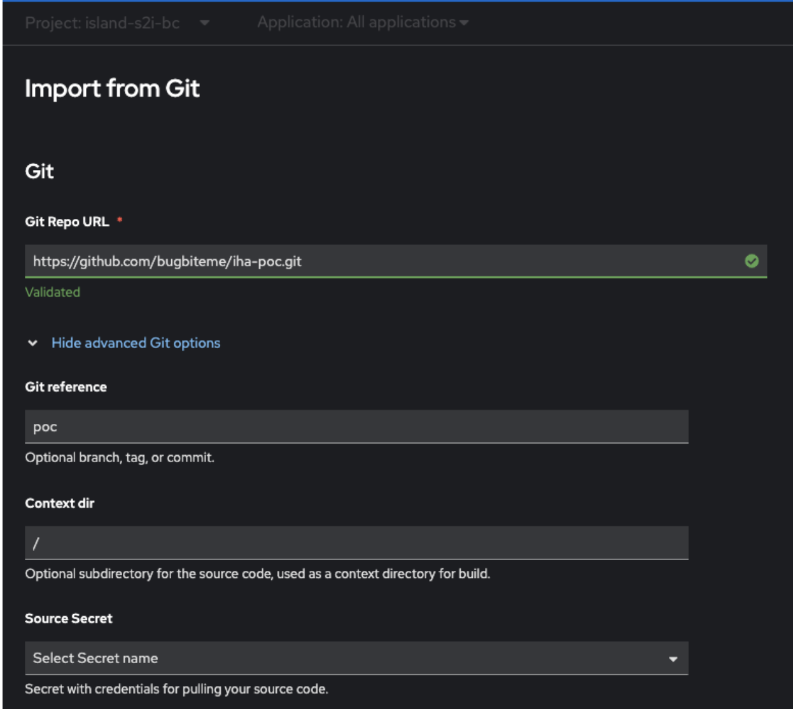
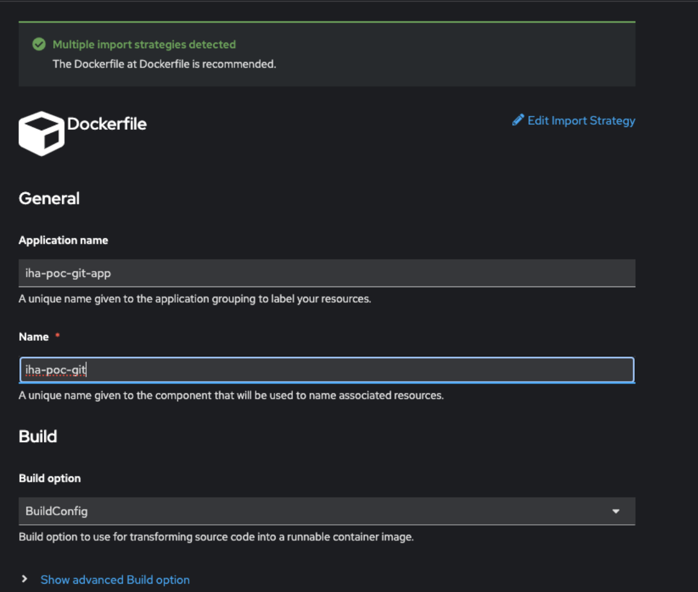
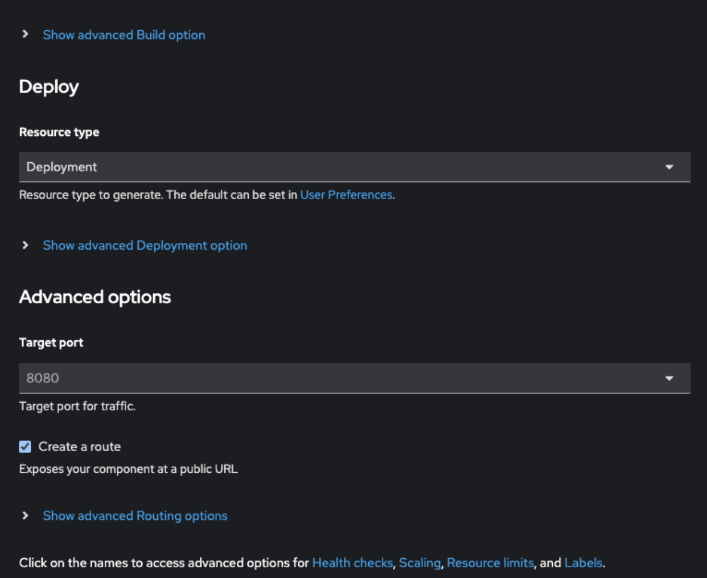

# Notes for running this POC

## Initial Setup

- be sure to fork repo first

  - from:  
`https://github.com/redhat-na-ssa/iha-poc.git`  
  - to:  
`https://github.com/<your org>/iha-poc.git`

- work off of branch `poc`  

```bash
git checkout branch poc
```

- Make sure you are on the correct branch from within your IDE


- Update three manifests with updated github URL:
  - `k8/app/eventlistener.yaml`
    - Line 34

```yaml
value: https://github.com/[CHANGE ME]/iha-poc.git
```
- `k8/app/pipeline.yaml`
    - Line 17
```yaml
value: https://github.com/[CHANGE ME]/iha-poc.git
```

- Once you have made the changes, commit and push the changes to the `poc` branch

- Log into both the OpenShift Web Consol and CLI
  - Once you log into OpenShift Web Console, you should be able to obtain the login credentials from the UI

  

```bash
oc login --token=sha256~<some long super secret token>
```

- Install the two following operators from OperatorHub
  1. Red Hat OpenShift Pipelines
  2. Red Hat OpenShift GitOps

## Exploring 3 deplyment methods

1. Manual s2i (BuildConfig) via the web consol

- Create a project `island-s2i-bc`
- Switch to the `Developer View`
- Ensure you are in the correct project
- Add a git-based app
  - +Add -> Import from Git
- Use build configuration to create from `poc` branch on repo





- Once deployed, you can follow the deployment logs 

